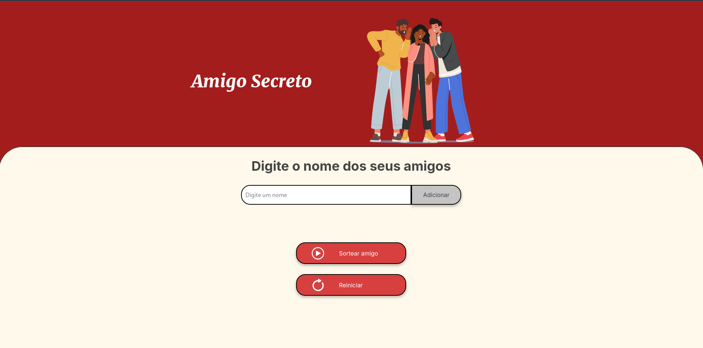

# Projeto Amigo Secreto (Alura-ONE)

## Explicação do Projeto
Este projeto é uma aplicação interativa criada no programa Oracle Next Education (ONE), projetada para facilitar a criação de uma lista de amigos e o sorteio de um amigo secreto de maneira simples e divertida. Seu desenvolvimento teve como propósito reforçar conceitos essenciais de lógica de programação e boas práticas de desenvolvimento.

## Funcionalidades
- **Adicionar nomes**: Permite inserir os nomes dos participantes em um campo de texto e adicioná-los à lista.
- **Validação de entradas**: O sistema verifica se o campo está vazio e exibe uma mensagem de erro, se necessário.
- **Visualização lista**: E Exibe dinamicamente os nomes adicionados.
- **Sorteio amigo secreto**: Seleciona aleatoriamente um nome ao clicar no botão "Sortear Amigo"
- **Exibição do resultado**: Exibe na tela o nome do participante sorteado.

## Ferramentas Utilizadas
- **Visual Studio Code**
- **HTML5**
- **CSS3**
- **JavaScript**

## Como executar o projeto

### Pré-requisitos
Você precisará de:
- Um navegador web (Google Chrome, Mozilla Firefox, etc.)
- Editor de código (opcional, ex.: VS Code)

###  Como usar
- Insira os nomes dos amigos no campo de texto.
- Clique no botão "Adicionar" para inserir o nome na lista.
- Após adicionar todos os nomes, clique em "Sortear amigo".
- O nome sorteado será exibido abaixo.